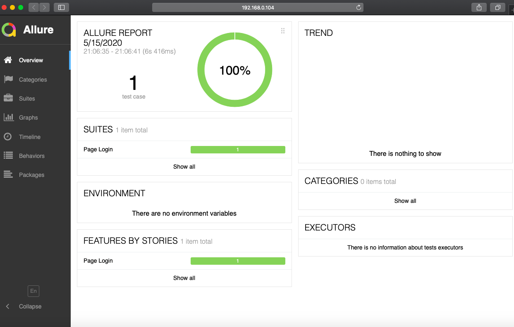

## Testcafe-Typescript-Starter

Testcafe typescript boilerplate with neat folder structure and allure report.

#### Key highlights

- Typescript support
- Neat folder structure
- Page object model for code maintenance
- ESLint support for code quality
- Prettier for code formatting
- Allure reporting
- Husky for pre-commit hook

#### Install dependencies

```ssh
npm install
```

#### Lint your code

```ssh
npm run lint
```

#### Run tests

```ssh
npm run e2e
```

#### Generate report

```ssh
npm run report

// publish report

npm run report:publish
```

Reports will be generated inside `reports` folder.

#### Debug tests

If you are using vscode, debug configuration is provided `.vscode/launch.json` file. Enable your breakpoints and hit `f5` to trigger the debug execution.

#### Test Folder Structure

```
testcafe
|____specs
| |____login.spec.ts
| |____home.spec.ts
|____utils
| |____password.handler.ts
| |____selector.helper.ts
| |____index.ts
| |____logger.helper.ts
| |____database.helper.ts
| |____waiter.helper.ts
|____pages
| |____login.page.ts
| |____home.page.ts
| |____index.ts
```

The page object model resides under `testcafe` folder.

- `pages` folder contains the page elements abd associated business logics
- `specs` folder contains testcafe fixures
- `utils` folder contains different testcafe helpers

##

Docker housekeeping, add --rm (docker run --rm -v ...) to remove docker container after tests end. takes up less disk space.
Runs docker image prune and docker containers prune regularly to delete old images & container to reclaim back precious disk space

#### Allure report

Reports will be generated for each test cases and allure will integrate those results and combine.


